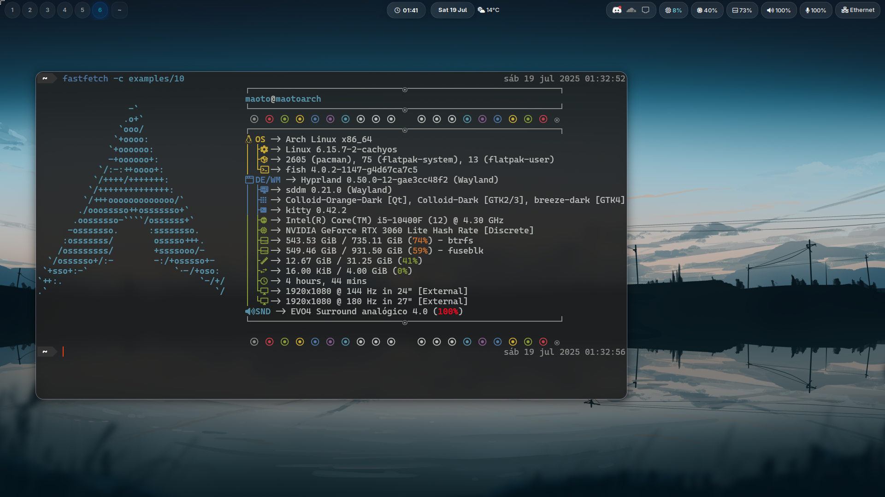

# maot's dotfiles

A comprehensive Arch Linux dotfiles setup featuring Hyprland compositor with a modern, aesthetic desktop environment.

## 📸 Preview



## 🎨 Features

- **Hyprland**: Wayland compositor with smooth animations
- **Fish Shell**: User-friendly shell with intelligent autocompletions
- **Waybar**: Highly customizable status bar
- **Wofi**: Application launcher for Wayland
- **Mako**: Lightweight notification daemon
- **Custom Screenshot Uploader**: Upload screenshots to s-ul.eu with one command

## 📦 What's Included

### Core Components
- **Hyprland** configuration with optimized settings
- **Fish** shell configuration with custom functions
- **Waybar** status bar with system monitoring
- **Wofi** application launcher styling
- **Mako** notification system configuration

### Additional Tools
- **sul-uploader**: Custom screenshot uploader for s-ul.eu
- **Wallpapers**: Curated collection of desktop wallpapers
- **Font configurations**: Inter, JetBrains Mono, Fira Code, and Nerd Fonts

## 🚀 Quick Installation

### Prerequisites
- Fresh Arch Linux installation
- Internet connection
- `git` installed

### Basic Installation

```bash
git clone https://github.com/maotovisk/dotfiles.git
cd maot_dots
chmod +x install_fresh.sh
./install_fresh.sh
```

### Complete Installation (with extras)

```bash
./install_fresh.sh --complete
```

This includes additional software like Docker, Visual Studio Code, Discord, Steam, and more.

## 🛠 Manual Installation

If you prefer to install components separately:

### 1. Install Dependencies Only
```bash
# Edit install_fresh.sh and run specific functions
./install_fresh.sh
```

### 2. Install Config Files Only
```bash
chmod +x install_dots.sh
./install_dots.sh
```

## 📁 Directory Structure

```
maot_dots/
├── config/                 # Application configurations
│   ├── fish/              # Fish shell config
│   ├── hypr/              # Hyprland config
│   ├── mako/              # Notification daemon config
│   ├── waybar/            # Status bar config
│   └── wofi/              # Application launcher config
├── local/
│   └── bin/
│       └── sul-uploader   # Screenshot uploader script
├── wallpapers/            # Desktop wallpapers
├── install_fresh.sh       # Main installation script
└── install_dots.sh        # Config files installation
```

## ⚙ Configuration

### Screenshot Uploader Setup

1. Create the config directory:
```bash
mkdir -p ~/.config/sul-uploader
```

2. Create config file:
```bash
echo "key=YOUR_S_UL_API_KEY" > ~/.config/sul-uploader/config.ini
```

3. Get your API key from [s-ul.eu](https://s-ul.eu/)

### Hyprland Keybindings

The Hyprland configuration includes optimized keybindings. Check `config/hypr/` for the complete configuration.

## 📦 Installed Packages

### Core Desktop Environment
- `hyprland` - Wayland compositor
- `waybar` - Status bar
- `wofi` - Application launcher
- `mako` - Notifications
- `fish` - Shell

### Complete Installation Extras
- **Development**: Docker, Zed Editor, Visual Studio Code
- **Communication**: Discord, Vesktop
- **Gaming**: Steam, osu! lazer
- **Utilities**: GPU Screen Recorder, fastfetch, htop, btop, bat, zoxide
- **Fonts**: Inter, JetBrains Mono, Fira Code, Noto fonts, Nerd Fonts

## 🎯 Usage

### Taking Screenshots
```bash
# Take a region screenshot and upload to s-ul.eu
sul-uploader
```

The screenshot will be automatically uploaded and the URL copied to your clipboard.

### Shell Features
Fish shell comes pre-configured with:
- Syntax highlighting
- Intelligent autocompletions
- Custom functions and aliases
- Zoxide integration for smart directory jumping

## 🔧 Customization

All configuration files are symlinked to your home directory, so you can:

1. Edit files in the `maot_dots/config/` directory
2. Changes will be reflected immediately
3. Version control your modifications

## 🐛 Troubleshooting

### Screenshot Uploader Issues
- Ensure you have a valid API key in `~/.config/sul-uploader/config.ini`
- Check that `hyprshot`, `curl`, `jq`, and `wl-clipboard` are installed
- Verify you're running under Wayland (Hyprland)

### Installation Issues
- Ensure you're running Arch Linux
- Check internet connection
